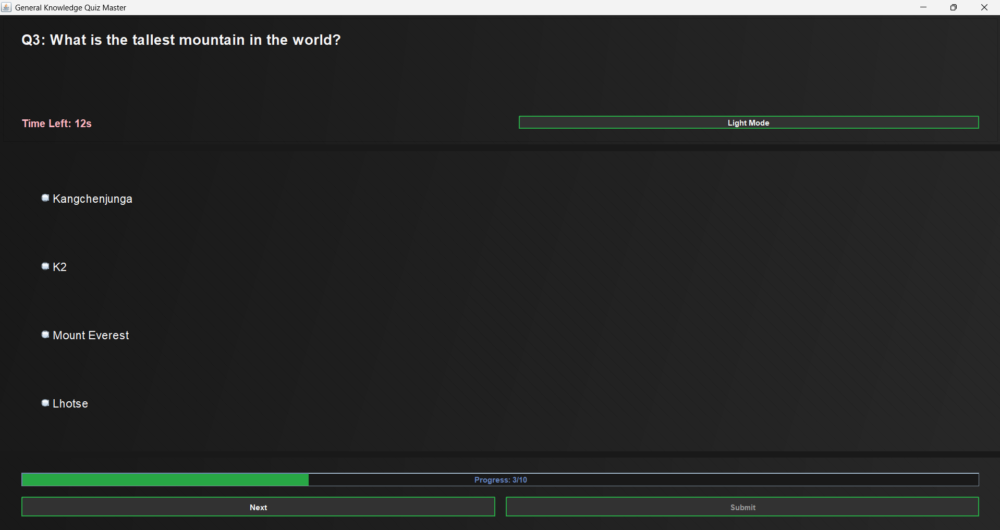

# 🎓 Java Swing Quiz Application

A beautiful and feature-rich **Quiz Application** developed using **Java Swing**, designed to deliver an interactive quiz-taking experience with real-time countdown, randomized question generation, and detailed scoring. Ideal for beginners to intermediates who want to showcase Java GUI and OOP skills.

---

## ✅ Features

- 🎨 **Attractive User Interface**  
- ⏱️ **Countdown Timer** for each quiz session  
- 🔀 **Randomized Questions** from a pool of 200+  
- 📚 **Multiple-Choice Format**  
- 📊 **Score Calculation and Summary**  
- 🌗 **Light & Dark Mode Toggle** (optional UI enhancement)  
- 🧱 **Modular Structure** with `Main`, `model`, `service` classes  
- 🚀 **Java Portfolio Ready**

---

## 🧩 Project Structure

QuizApp/
├── src/
│ ├── Main.java // Launches the quiz
│ ├── model/
│ │ └── Question.java // Question model
│ ├── service/
│ │ └── QuizService.java // Business logic (load, randomize, evaluate)
│ └── ui/
│ └── QuizUI.java // GUI layout and event handling
├── questions.txt // Pool of 200+ questions (optional)
├── README.md // Project documentation


---

## 🚀 How to Run

### 🧰 Prerequisites

- Java JDK 8 or higher
- Any IDE (e.g., IntelliJ, Eclipse, VS Code with Java Extension Pack)

### 🖥️ Steps

1. **Clone the repository**  
   ```bash
   git clone https://github.com/srikanthramagani/QuizApp.git
   cd QuizApp
2.**Open in IDE
Import the QuizApp folder as a Java project.

Run Main Class
Locate Main.java and run it.

Enjoy the Quiz! 🎉

📝 Customization
To add your own questions, edit or replace questions.txt with your desired MCQs.

Each question should follow a format like:

less
Copy
Edit
Question?
A. Option1
B. Option2
C. Option3
D. Option4
Answer: A
📸 Screenshots

(Replace with your actual screenshots inside a /screenshots folder.)



📂 GitHub Tags
#Java #Swing #QuizApp #OOP #PortfolioProject #DesktopApplication

🙋‍♂️ Author
👤 Your Name
🔗 GitHub
📧srikanthramagani@gmail.com


